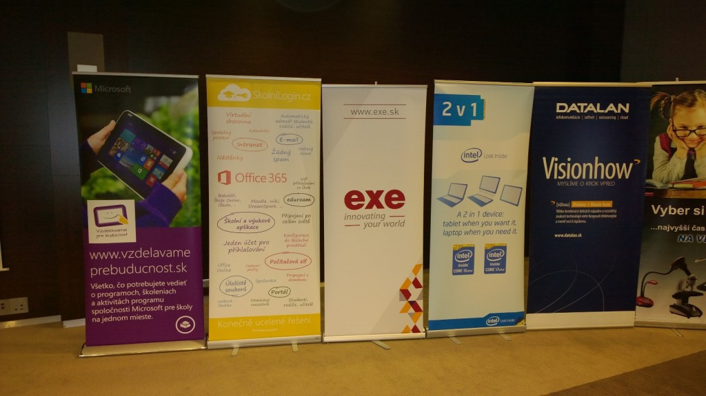
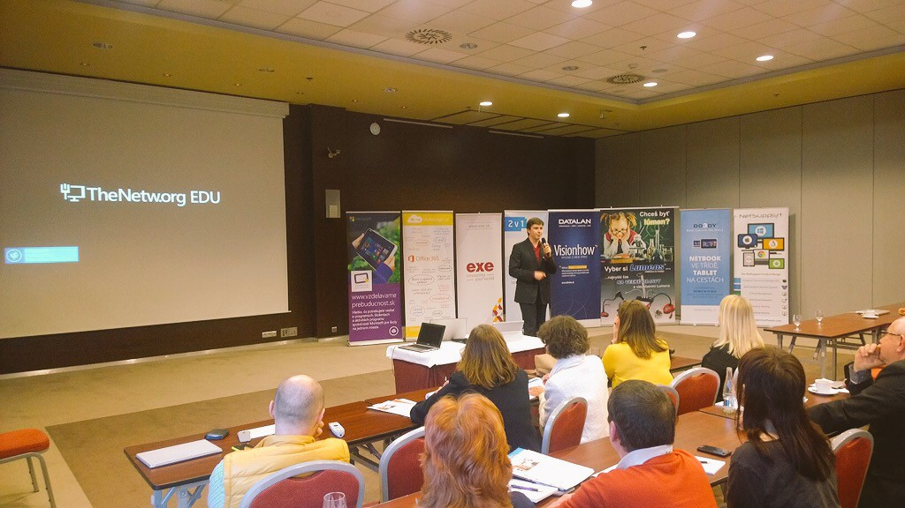
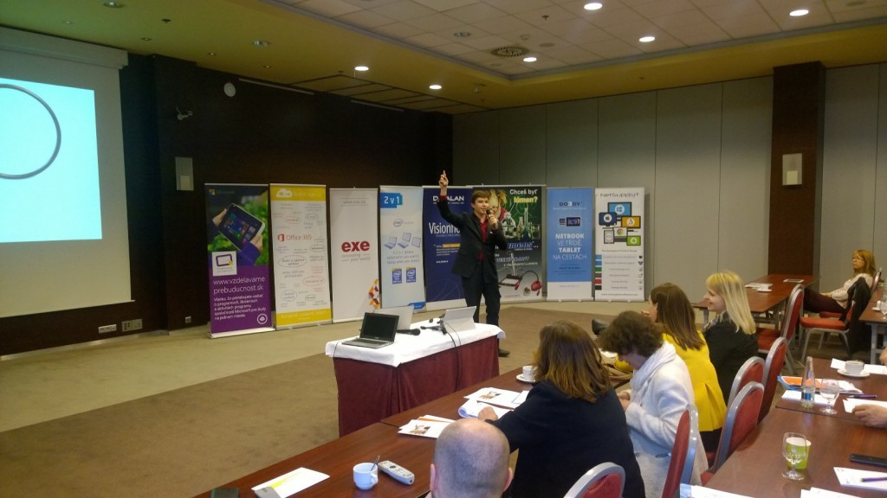
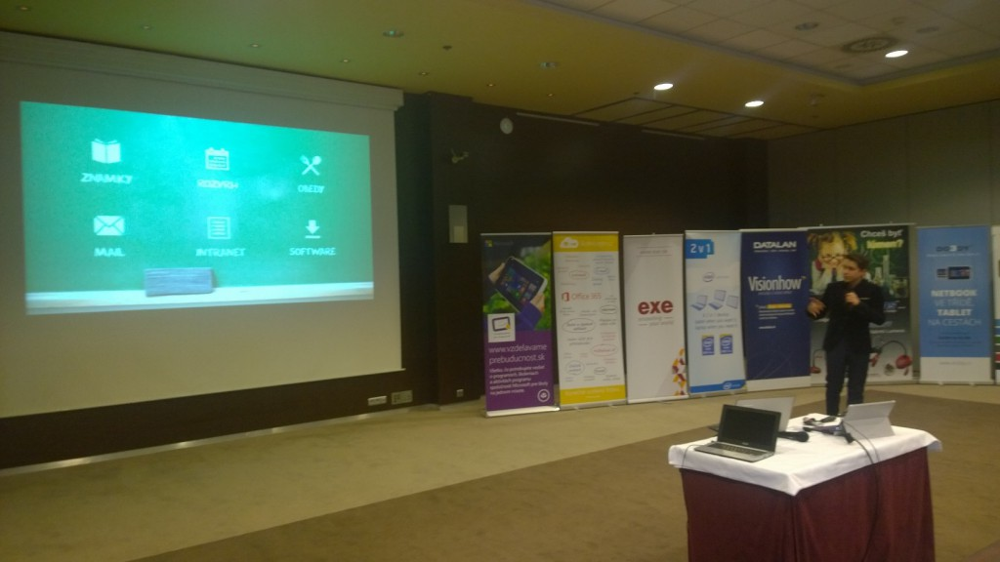

Kolona aut na 149 kilometru dálnice Praha-Brno vypadá nekonečně. Osmá hodina nás stíhá ještě rozespalé, ale my přesto sedíme v autě mířicím na Slovensko. Čeká nás Den D - premiéra SkolniLogin.cz na konferenci Microsoftích Partnerou ve vzdelávanie v Žilině a ještě předtím nasazení na pilotní škole v Novém Mestě nad Váhom společně se slovenským Microsoftem.

Krátká zastávka před hranicemi - kafe a súša na benzině, porada k prezentaci a hurá do Nového Mesta.

S každým vtipem o tom, jak asi Slovákům porozumíme (někteří by řekli, že už jsme ta _iná generácia_) se dostáváme do správné nálady a nervozita pomalu opadá - zatím. Máme ohromné štěstí, že naše pilotní škola na Slovensku je ZSPŠ Nové Mesto nad Váhom - jedná se o velmi inovativní instituci. Veškerá jednání s vedením se ukázala být bezproblémová a již brzy se celé osazenstvo školy bude přihlašovat pomocí našeho žlutého tlačítka.

Krátký oběd s informatiky ze školy a již vyrážíme do finální destinace - na konferenci do Žiliny.

 

“Dvanáctý ročník konferencie Microsoft pre školstvo - Vzdelávame pre budúcnosť” se odehrával v luxusním čtyřhvězdičkovém hotelu Holiday Inn. Pedagogové se stejně jako my připravovali na své prezentace a při pohledu na publikum se míra nervozity zase mírně zvýšila. Po skvělých výkonech akademické špičky Slovenska se na stage nastupovalo jen těžko, ale ta chvíle přišla během chvíle.

“Krásný dobrý den, dámy a pánové. Máte tady klíče? A kolik?…”

Po prezentaci, do které jsme se tolik ponořili, nás vrátil do reality bouřlivý potlesk a my si mohli oddechnout. Mnozí z profesorů nás po ukončení vyhledali a chtěli si promluvit o našem řešení pro školy. A pak už se jen ubytovat v Innu a mohli jsme spěchat na raut s cimbálkou.

SkolniLogin.cz již tedy znají i na Slovensku. A kdy se objeví na Vaší škole?
