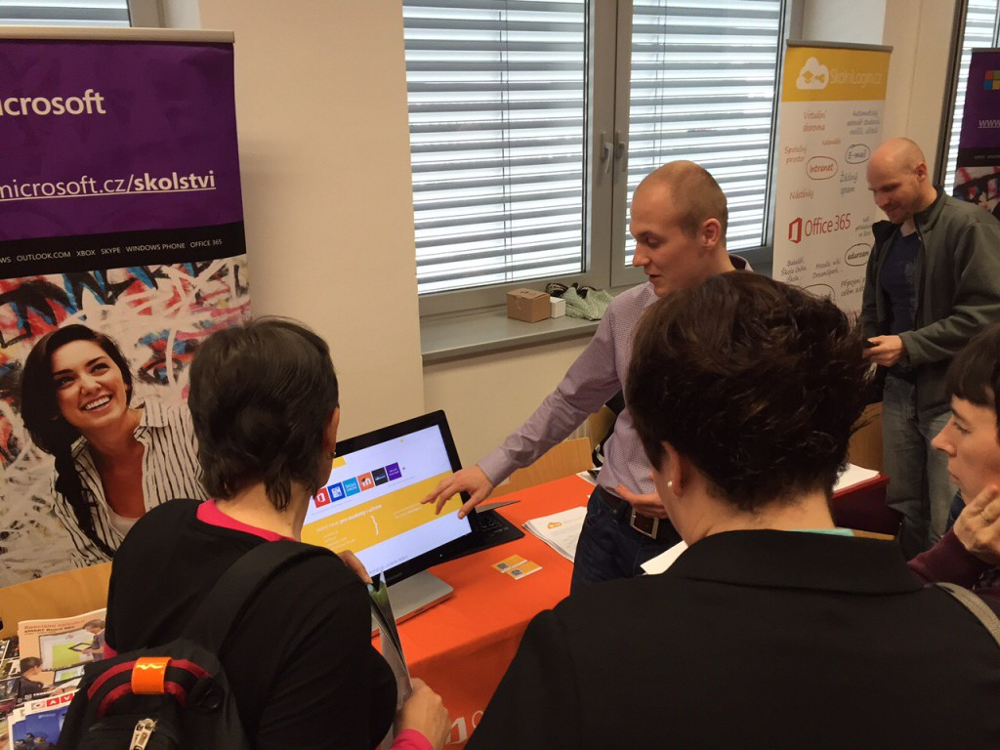
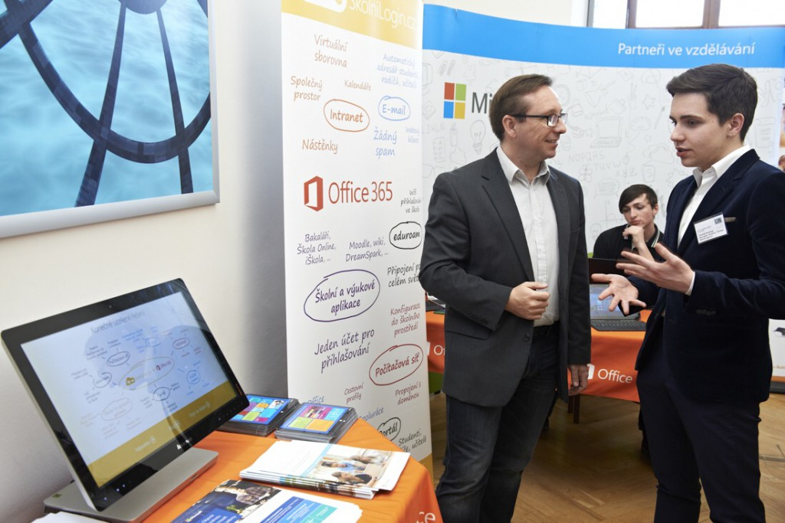

Květen byl pro nás ve znamení konferencí - ICT ve školství a [Roadshow pro školy](http://www.roadshowproskoly.cz/). Každým dnem jiné město, každým dnem série přednášek o Office 365 a našem řešení, každým dnem jiná skupina aktivních pedagogů. A s každým učitelem, kterého jsme zaujali, naše nadšení a studentské zapálení stoupá. Zdá se, že se SkolniLogin.cz může stát nejen službou pro chod škol, ale i zajímavou organizací zastřešující pedagogickou komunitu nadšenců, kteří mají zájem posouvat vzdělávání hlouběji do 21. století.

Zároveň jsme si prošli další publikační činností. Náš článek jste si mohli přečíst v časopise Perpetuum společnosti SCIO a v červnu budete mít možnost tak učinit v časopise Řízení Školy.

<iframe class="aligncenter" src="https://onedrive.live.com/embed?cid=66EBEDB2D990CDDC&amp;resid=66ebedb2d990cddc%21461692&amp;authkey=AC7CqHJUADTHw90&amp;em=2" width="620" height="486" frameborder="0" scrolling="no"></iframe>

 

 

Květen jsme již úspěšně uzavřeli a červen nás čeká neméně nabitý. A již nyní a během prázdnin pro Vás chystáme mnoho propečených novinek.

A jaký květen jste měli Vy? Co říkate na nápad komunity fungující pod naší záštitou? Nechte nám vzkaz v komentářích :)
