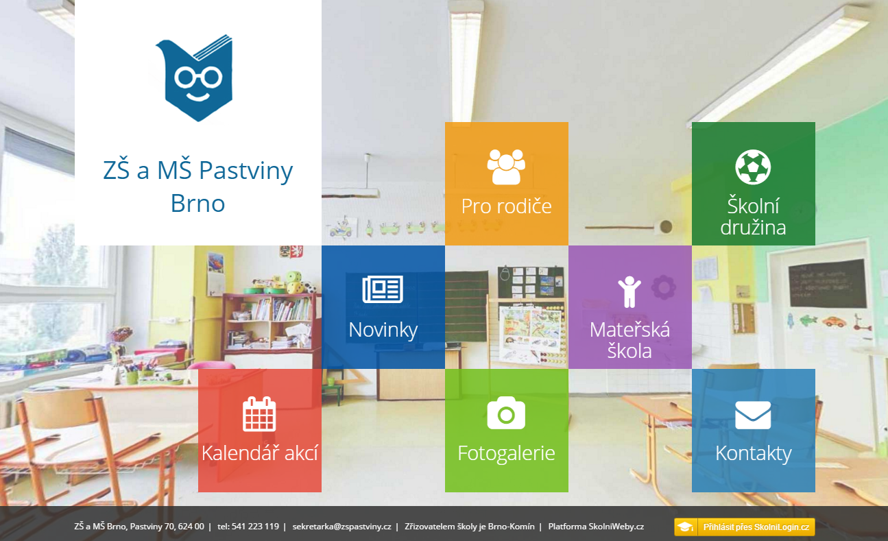
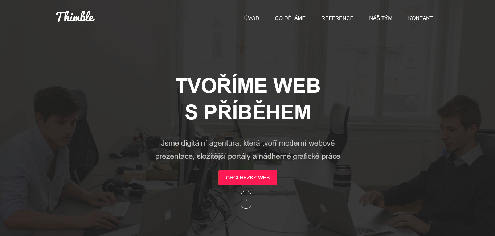

Již minulý rok jsme společně se službou SkolniLogin.cz začali připravovat rozšíření našeho portfolia o platformu školních webových stránek.

Mnoho důvodů nás motivovalo se něčemu takovému věnovat. Dnes sice existuje nespočet firem a vývojářů, kteří jsou schopni připravit dobrý web na míru a relativně levně, ale naší původní myšlenkou nebylo pouze škole vytvořit web na základě specifikace, kterou dodají. V případě Office 365 (konkrétně SharePoint Online) jsme při tvorbě intranetu zjistili, že je pro zákazníka velmi přínostné, když mu ukážeme, jaké má škola v takovém prostředí vůbec možnosti. Díky většímu množství různých škol jsme brzo získali dlouhý seznam požadavků a návrhů k našemu řešení. Tím se naskytla možnost vytvořit velké demonstrační prostředí, kde si teprve zákazník může utvořit představu, co by se dalo využít.

Pro školu je řádný web velmi důležitý. Většina uchazečů o studium si podle webové prezentace utvoří první dojmy.

V praxi jsme se setkali například i s problémy, kdy byly stránky těžko dostupné (hlavně v období zveřejňování výsledků přijímacího řízení), protože si je škola hostovala sama a neměla na to při špičkách kapacity. Z toho důvodu jsme připravili náš výhodný sdílený hosting, který má v pozadí technologii [Microsoft Azure](https://azure.microsoft.com/cs-cz/). V kombinaci s ochranou domény a [reverzní proxy](https://cs.wikipedia.org/wiki/Reverzn%C3%AD_proxy) od SkolniLogin.cz je riziko napadení značně minimalizováno.

 

 

Weby jsme začali stavět nad redakčním systémem [WordPress](https://wordpress.org/). Jednou z prvních škol, kde jsme takový web nasadili je [www.zspastviny.cz](http://www.zspastviny.cz).

Další důležitou věcí pro nás bylo směrování na školní portál aplikací, integrace přihlašování a kalendářů se SkolniLogin.cz.

Koncem roku 2015 jsme přišli do kontaktu s [Thimble.cz](http://thimble.cz/), kteří nám nyní pomáhají rozjet prezentaci pro nabídku řešení SkolniCloud.cz. Je to tým mladých lidí, kteří nás oslovili jejich přístupem. Mají bohaté zkušenosti s tvorbou webů a designem. V oblasti školství jsou také velmi vidět. Jejich web [ucseonline.cz](http://www.ucseonline.cz/), který do této doby zaznamenal téměř 4 miliony návštěv, byl jednu dobu 1. nejnavštěvovanější web školství v ČR podle [metriky TOPlist](http://www.toplist.cz/skolstvi).

Od ledna začíná naše širší spolupráce. Thimble dodá vlastní jednoduchý redakční systém, bude se starat o analýzu a tvorbu webů. My zajistíme volitelný hosting, zabezpečení a bezproblémové napojení na naše služby.

 

https://www.facebook.com/decker.honza/posts/1013809368657445

 

Pevně věříme, že jejich práce posune SkolniWeby.cz mnohem dále a společně dosáhneme cílů našich i zákazníků.

Řešení bude současní chystané nabídky SkolniCloud.cz. Pokud máte zájem již nyní, můžete nás kontaktovat na [poptavka@skolnicloud.cz](mailto:poptavka@skolnicloud.cz).

 

