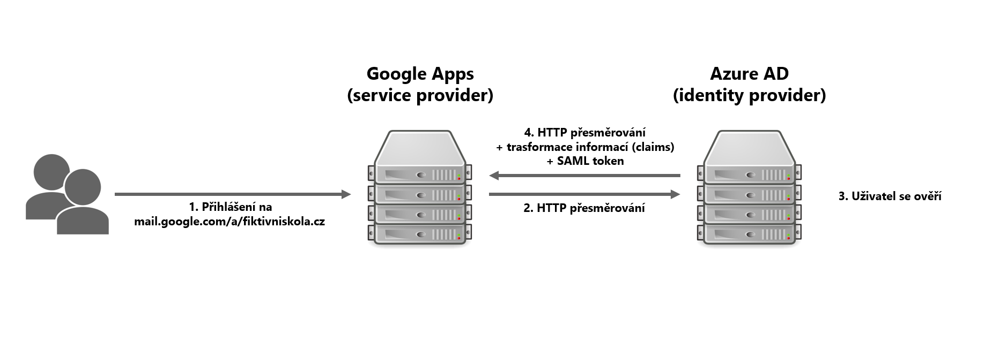
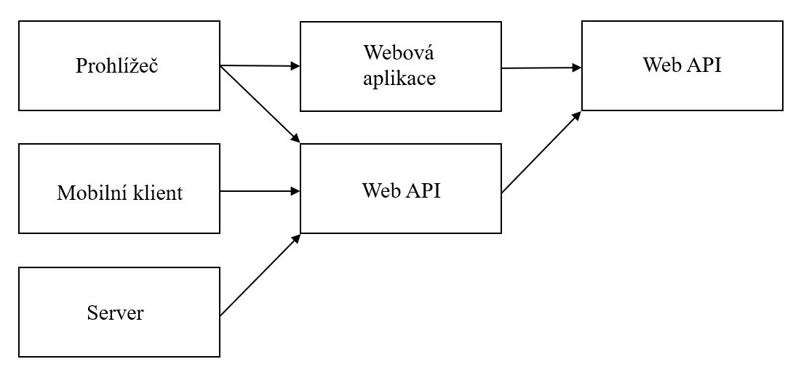

Přečtěte si další informace v sérii, kde přibližuji problematiku vytváření sjednocené identity. V článku naleznete přehled tří rozšířených standardů pro autorizaci, autentizaci a správu uživatelů.

Obr. 1 - Příklad využití SAML 2.0

Jak na jednotnou identitu:

- [1\. část - Adresářové služby](https://blog.skolnilogin.cz/jednotna-identita-1/)
- [2\. část - Protokoly](https://blog.skolnilogin.cz/jednotna-identita-2/)
- 3\. část - Nástroje pro správu

 

## Protokoly

### LDAP v3

Lightweight Directory Access Protocol slouží k manipulaci s daty v adresářové službě. Můžete jej využívat např. ve spojení s Active Directory ve vaší lokální síti. Umí zpracovávat složité dotazy, vkládat, upravovat a mazat záznamy. Lze jej též využít k autentizaci. Službu je možné představit si jako strom se záznamy, které mají svoje jedinečné jméno (distinguished name, DN). Záznamy mají atributy (povinné a volitelné), které jsou na serveru definovány pomocí třídy objektů.

Protokol je definován pomocí čtyř modelů:

- **Informační model (schéma)** – popisuje atributy
    - **Object class** – Kategorie záznamů, které je možné vytvářet. Jeden záznam může mít více tříd.
    - **Attribute** – Povinné nebo volitelné vlastnosti záznamů, které přísluší určité třídě. Schéma určuje typ hodnot, kterých může nabývat.
    - **Leaf object / Container object** – Rozlišení, které určuje jestli má objekt potomky.
- **Jmenný model** – organizace a identifikace
    - **Distinguished Name (DN)** – Příklad: _CN=Tomáš Prokop,OU=Správci,DC=fiktivniskola,DC=local_ Prvním záznamem v identifikátoru je část domény (Domain Component, DC), dále je v hierarchii další část domény, následuje organizační jednotka (Organizational Unit, OU) a poslední část je RDN, které označuje objekt s atributem CN (Common Name).
    - **RDN** – Relativní DN je poslední část DN a je unikátní v rámci Container object. Je to některý z atributů záznamu.
- **Funkční model** – operace pro zacházení s informacemi
    - **Autentizace**
        - Bind – zahájení spojení, dohodnutí na metodách ověření
        - Unbind – ukončení spojení
        - Abandon – přerušení odpovídání
    - **Dotazování**
        - Search – filtrování výsledků
        - Compare – porovnávání hodnoty atributu
    - **Aktualizace**
        - Add – vytvoření nového záznamu
        - Modify – úprava atributů
        - Delete – smazání záznamu
    - **Bezpečnostní model** – přístup a ověřovací metody při Bind operaci
        - **Simple Authentication and Security Layer (SASL) (4)** – framework s různými ověřovacími mechanismy
            - Plain – žádné šifrování
            - Anonymous – bez ověření
            - Kerberos – Protokol, který využívá třetí stranu (server) k přidělení tiketu. Tiket následně slouží k prokázání identity.
            - OTP – jednorázová hesla
            - DIGEST-MD5 – generování unikátní odpovědi tajným heslem
        - **Rozšíření pro [TLS](https://cs.wikipedia.org/wiki/Transport_Layer_Security)**[ ](https://cs.wikipedia.org/wiki/Transport_Layer_Security)– šifrování přenášených dat

 

### [OAuth 2.0](https://cs.wikipedia.org/wiki/OAuth)

Tento standard definuje několik schémat ověření klientského přístupu k prostředkům. Šipky v následující grafice (Obr. 1) znázorňují možné scénáře, které protokol podporuje, kdy je nutné ověřit identitu uživatele. Žadatel o přístup vždy obdrží textový řetězec (token), který následně zasílá společně se svými požadavky na zabezpečené prostředky.

 

Obr. 2 - subjekty v OAuth 2.0

 

Obvykle má token expirační lhůtu a po nějaké době je nutné jej obnovit. Pokud aplikace získá i obnovovací token, může jej využít k získání nového přístupového tokenu. Klientská aplikace může získat přístupový token několika způsoby:

- **Authorization code grant** – Uživatel je přesměrován na stránku, kde se přihlásí. Ověřovací server přesměruje uživatele zpět na server klientské aplikace a do požadavku zahrne autorizační kód. Server klientské aplikace následně vymění autorizační kód s ověřovacím serverem za přístupový a obnovovací token.
- **Implicit grant** – Využívá se například přímo v jazyce JavaScript na straně klienta. Ověřovací server přesměruje uživatele zpět na původní adresu a za ní přidá přístupový token. Aplikace si ho následně z adresy vyjme.
- **Resource owner grant-** Klient předá ověřovacímu serveru jméno a heslo uživatele.
- **Client credentials grant** – Aplikace ověří sama sebe pomocí svého id a tajemství.

Ve standardu není specifikováno, jakým způsobem aplikace zjistí informace o uživateli. Tradičně proběhne následné dotázání serveru na chybějící data. Je též možné využít další vrstvu zvanou OpenID Connect, která je postavená nad OAuth 2.0. Po její implementaci aplikace získá navíc id token, který obsahuje potřebné údaje o ověřeném uživateli a ušetří si požadavek navíc. Token je ve formátu JSON Web Token (zkráceně JWT) a obsahuje podpis, takže je možné jej ověřit.

 

### [SAML 2.0](https://cs.wikipedia.org/wiki/Security_Assertion_Markup_Language)

Protokol využijete například, když chcete uživatele při přístupu k Google Apps ověřit pomocí účtu v Azure AD (Office 365) (viz. obrázek 1 v úvodu článku).

Security Assertion Markup Language je standard pro výměnu bezpečnostních informací mezi poskytovatelem služeb (service provider) a poskytovatelem identity (identity provider), kteří mají mezi sebou navázanou důvěru (vytvořenou tzv. federaci). Po provedení autorizace autentizace poskytovatel identity předává tvrzení (SAML Assertion), které obsahuje údaje o čase, autoritě, předmětu a splněných podmínkách.

 

Příště budeme pokračovat nástroji pro správu.

Máte nějaké dotazy ohledně této problematiky nebo máte tip na článek s tématem, o kterém se chcete dozvědět více?

\[contact-form to='tomas.prokop@thenetw.org' subject='Blog form'\]\[contact-field label='Email' type='email' required='1'/\]\[contact-field label='Co vás zajímá?' type='textarea' required='1'/\]\[/contact-form\]
