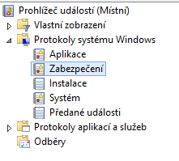

Tento článek přiblížuje podrobnosti jednoho konkrétního případu, který jsme zaznamenali v síti u jednoho z našich zákazníků.

Několik dnů zpět jsme byli svědky něčeho, s čím jsme se doposud v praxi nesetkali. Je důležité podobným věcem z pohledu správce věnovat pozornost, nepodceňovat je a aktivně jim předcházet.

Minulý týden bylo nutné udělat úpravu v konfiguraci důležitého virtualizačního serveru, na který se v běžném provozu vůbec nepřistupuje, není součástí domény a není mu věnována velká pozornost. Do serveru nebylo možné se vzdáleně přihlásit. Následoval pokus lokálního přihlášení, ale ten byl také neúspěšný.

Po krátké analýze situace se zjistilo, že na stroj zůstaly poslední dva měsíce přesměrované porty z internetu pro protokol vzdálené plochy RDP a heslo administrátora nebylo dostatečně komplexní. Podezření se po chvíli potvrdilo a začali jsme pátrat po dalších detailech pravděpodobného brute force útoku. Zjistili jsme, že server navštívili minimálně dva různí útočníci a vše nasvědčuje tomu, že někdo mohl získaný stroj nabízet na [Darknetu](http://www.kurzy.cz/zpravy/382630-darknet-aneb-cesta-do-hlubin-internetu/).

Důrazně doporučujeme stroj ihned přeinstalovat a minimálně s ním dále operovat v produkčním prostředí. My jsme jej okamžitě izolovali od okolní sítě a pracovali s ním v laboratorních podmínkách.

 

V tomto případě se stalo to, že útočník změnil heslo administrátorského účtu a vytvořil si účet další. Kdyby tento krok neudělal, trvalo by mnohem déle, než by byl odhalen.

* * *

 

**Resetování hesla administrátorského účtu (Utilman.exe hack):**

(Pouze pokud není systémový disk šifrovaný - BitLocker apod.)

_Utilman.exe_ je nástroj, který je možné spustit na přihlašovací obrazovce systému Windows. Pomocí něj je možné nastavovat přístupnost systému (např. klávesnice na obrazovce). Proces je spuštěn s právy uživatele _SYSTEM_, který je oprávněn změnit heslo. Využijeme toho a místo _Utilman.exe_ spustíme _cmd.exe._ Pomocí příkazové řádky heslo změníme.

1. Opatřete si instalační médium Windows (ideálně stejnou verzi operačního systému) a nechte z něj server nabootovat.
2. V menu vyberte **Next**, **Repair your computer**,** Troubleshoot** a **Command Prompt**.
3. Nyní se otevřela příkazová řádka a je nutné najít jednotku, na které je nainstalovaný systém. Vyzkoušejte zvolit jednotku pomocí **c: **a přes příkaz **dir** vylistovat obsah. Pokud uvidíte složku **Windows**, máte vyhráno.
4. Přejděte do složky: **cd windows\\system32**
5. Přejmenujte spustitelný soubor, aby jej bylo možné později obnovit: **ren Utilman.exe Utilman.exe.old**
6. Vytvořte kopii _cmd.exe_: **copy cmd.exe Utilman.exe**
7. Ukončete příkazovou řádku pomocí **exit **a pokračujte v nabootovaním systému.
8. Na přihlašovací obrazovce stiskněte **Win+U **a zobrazí se vám příkazová řádka s právy _SYSTEM_.
9. Změňte heslo uživatele: **net user uzivatel Heslo1234 **

* * *

 

Po úspěšném přihlášení jsme začali zkoumat způsobené škody. Jako první jsme prošli historii prohlížení webu. První útočník nevyužil ani výchozí prohlížeč a ihned přes RDP nakopíroval a instaloval prohlížeč Opera. Pokoušel se pomocí serveru Amazon koupit odemknutý iPhone 6. Zvláštní bylo, že po sobě neuklidil a zjistili jsme i uživatelské jméno v online obchodu.

Následně jsme se pokoušeli zjistit původ útoku podle zaznamenaných logů. Zjistili jsme, že někdo byl na server vzdáleně připojen ještě několik minut před námi.

* * *

 

**Otevření prohlížeče událostí:**

1. Otevřete okno pro spouštění procesů pomocí zkratky **Win+R**.
2. Zadejte **eventvwr.msc** a potvrďte.

**Neplatné pokusy o přihlášení:**

Pro vyhledání neúspěšných pokusů o ověření otevřete ve v stromu v levém panelu protokol **Protokoly systému Windows > ****Zabezpečení**.

Nyní je nutné vyfiltrovat záznamy s **ID události 4625**. Lze tak učinit pomocí možnosti **Filtrovat aktuální protokol** v pravém panelu Akce.

Při zobrazení detailu události můžete mimo jiné zjistit uživatelské jméno, kterým se dotyčný pokoušel přihlásit, a název klienta.

Pokud připojení neproběhlo přes zabezpečené Secure RDP, tak zdrojovou IP neuvidíte. Tento údaj je možné získat z jiného protokolu **Protokoly aplikací a služeb > Microsoft > Windows > TerminalServices-LocalSessionManager > Operational (ID události 24)**. Toto je možné bohužel pouze pro úspěšná připojení. Zjistíte tak útoky, pomocí kterých se útočník na stroj skutečně dostal.

* * *

 

Pro zjištění informací o zdrojové síti lze využít nějaký online lookup nástroj (např. [ip-lookup.net](http://ip-lookup.net/)), ale informací zjistíte minimum a nelze se na ně spolehnout. V tomto případě jsme odhalili dvě IP adresy a obě patřily hostingovým společnostem (Velká Británie a Francie). To v praxi znamená, že se dotyční úspěšně schovali za cizí např. za virtuální stroj. Na základě protokolů jsme se zaměřili na druhého útočníka, který vytvořil účet _support _a změnil stávající heslo administrátorského účtu.

Objevili jsme software, který prochází web pomocí vyhledávačů a ukládá emailové adresy do souboru. Zde útoční hledal adresy s doménou .nl pomocí google.nl.

 

**Doporučení pro ochranu:**

- Zvažte nutnost viditelnosti serveru z internetu. Případně využijte bezpečnějších alternativ jako je VPN, které dodají další úroveň zabezpečení.
- Volte jiné porty než ty výchozí. Tím snížíte pravděpodobnost odhalení otevřeně přístupných služeb.
- Důsledně využívejte dlouhá komplexní hesla.
- Vyvarujte se výchozích a konvenčních uživatelských jmen (např. Administrator).
- Váš síťový router/firewall by měl disponovat funkcí Intrusion Prevention System (IPS), která slouží k analýze provozu a zabraňování podobných útoků.
- Nastavte uzamknutí účtu na určitý čas po několika neúspěšných pokusech o přihlášení. Toho můžete docílit pomocí skupinových politik.

* * *

 

**Nastavení uzamknutí účtu:**

Pokud je počítač součástí domény Active Directory, zvažte nastavení politiky centrálně. Následující kroky popisují nastavení místních zásad.

1. Otevřete okno pro spouštění procesů pomocí zkratky **Win+R**.
2. Zadejte **gpedit.msc** a potvrďte.
3. Ve stromu přejděte na **Konfigurace počítače > Nastavení systému Windows > Nastavení zabezpečení > Zásady uzamčení účtů**.
4. Nejprve nastavte zásadu **Prahová hodnota pro uzamčení účtu**, která určuje počet neúspěšných pokusů o přihlášení, po kterém se uživatelský účet uzamkne.
5. Doba, na kterou bude účet nepřístupný, a vynulování čítače se automaticky nastaví na 30 minut. Pokud chcete výchozí hodnoty změnit, uděláte tak pomocí zásad **Doba uzamčení účtu **a  **Vynulovat čítač uzamčení účtu po**.

