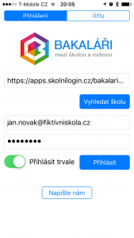

Od 18. listopadu mají školy k dispozici [novou verzi informačního systému Bakaláři](http://www.bakalari.cz/akt_verze17.aspx). Ten kromě jiných vylepšení přináší i nové uživatelské rozhraní (tzv. NEXT) pro všechny školy. Toto uživatelské rozhraní je více moderní a nabízí lepší podporu mobilních zařízení.

Díky službě [SkolniLogin.cz](https://www.skolnilogin.cz) tak můžete využívat váš školní účet pro přihlašování do prostředí Bakaláři a plynule přepínat mezi klasickou verzí a verzí NEXT, bez nutnosti si pamatovat přihlašovací údaje do dalšího systému.

Kromě podpory nové webové verze jsme také zavedli podporu pro přihlašování do mobilní aplikace Bakaláři ([Windows](https://www.microsoft.com/cs-cz/store/p/bakalari-oficialni-aplikace/9nblggh62qvs), [Android](https://play.google.com/store/apps/details?id=cz.impire.bakalari.student&hl=cs), [iOS](https://itunes.apple.com/cz/app/bakalari-oficialni-aplikace/id1070211765?l=cs&mt=8)) pomocí účtu SkolniLogin.cz! Princip je velmi jednoduchý, stačí do aplikace napsat následující:

- _Adresa serveru:_ **https://apps.skolnilogin.cz/bakalari-m/{vase-uzivatelske-jmeno}**
    - Např: _https://apps.skolnilogin.cz/bakalari-m/jan.novak@fiktivniskola.cz_
- _Uživatelské jméno:_ vaše jméno, kterým přistupujete do SkolniLogin.cz, Office 365 nebo vaší sítě
    - Např.: _jan.novak@fiktivniskola.cz_
- _Heslo:_ heslo k účtu, kterým přistupujete do SkolniLogin.cz, Office 365 nebo vaší sítě

Následně budete do aplikace přihlášeni vaším účtem SkolniLogin.cz. V případě problémů či otázek [kontaktujte naši podporu](mailto:podpora@skolnilogin.cz).

